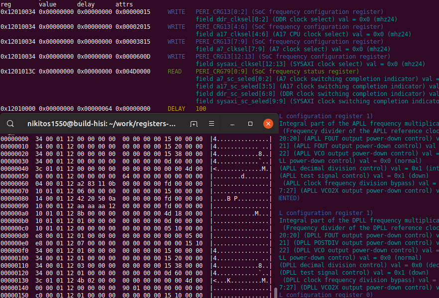

<!--
<p align="center">
 
</p>
-->
<h3 align="center">hisi-initregtable-go-parser</h3>

---

<p align="center">HiSilicon SoC`s U-Boot initial register table parser into human readable format</p>
<p align="center"><em>Part of <a href="https://www.openhisiipcam.org">OpenHisiIpCam</a> project</em></p>

## :eyeglasses: About

This small application has several goals: 
* Useful tool for low level HiSilicon ip camera SoCs initialization research (at least it is applicable for chips that use U-Boot 2010.06).
* Example how cool and easy we can use machine readable SystemRDL described registers information (more information in [How does it work](#how_does_it_work) section).

This is example output (left bottom corner is data view before parsing):



As you can see, after parsing, for each item in registers initilization table we have following information:
* **Operation** (WRITE, READ or DELAY).
* **Register**, that is used by operation.
* Register`s **fields**, that are affected.
* Each field **value meaning**.

Format of initial registers table, questions why there is such table, how it works, how to extract it from ROM image and so on are a bit out of scope this document. 
Mostly it will be useful for people, who already faced with HiSilicon`s U-Boot, somehow knows what is going on and 
looking for additional tools other than those provided by the vendor.
More information you can find follow links in [Futher information](#futher_information) section.

## :hammer: Usage

### Build

Prerequistives are go, python3

**TODO**

### Run

```console
foo@bar:~$ hisi-initregtable-go-parser -help
```

```console
foo@bar:~$ hisi-initregtable-go-parser -file ./regbins/reg_info_hi3519v101.bin -offset 0 -size 4016
```

## :bulb: How does it work <a name="how_does_it_work"></a>

**TODO**

Overall pipilene is following: `systemrdl sources -> golang sources -> final binary`.

SystemRDL data is parsed and coverted in go source code by rdl_to_go.py.
There is regs.go source file, it describes structs for regsiter, field and field`s value and operations over these types. 
Generated source is basicly instances of types defined in regs.go with data from rdl files.

Example systemrdl:
```
...
    reg {
        name = "APLL configuration register 0";

        field {
            name = "Level-2 output frequency divider of the APLL";
        } apll_postdiv2[30:28];

        field {
            name = "Level-1 output frequency divider of the APLL";
        } apll_postdiv1[26:24];

        field {
            name = "Decimal part of the APLL frequency multiplication coefficient";
        } apll_frac[23:0];

    } PERI_CRG_PLL0 @ 0x0000;
...
```
Goes into following golang code:
```go
//...
var registers = [...]register32{
    register32{
        addr: 0x12010000,
        name: "PERI_CRG_PLL0",
        desc: "APLL configuration register 0",
        fields: []field{
            field{
                bitStart: 0,
                bitEnd:   23,
                name:     "apll_frac",
                desc:     "Decimal part of the APLL frequency multiplication coefficient",
            },
            field{
                bitStart: 24,
                bitEnd:   26,
                name:     "apll_postdiv1",
                desc:     "Level-1 output frequency divider of the APLL",
            },
            field{
                bitStart: 28,
                bitEnd:   30,
                name:     "apll_postdiv2",
                desc:     "Level-2 output frequency divider of the APLL",
            },
        },
    },
    //...
}
```
> Most probably exact this implementation is not the best one. 
> For some cases it is possible improve memory usage for register database and make register/field/value lookup faster.

Generation itself is just text manipulations. Such technique is simplest, it doesn`t allow any ... TODO

Obviosly the parser can be done in python3 as well as systemrdl-compiler, and step with golang can be eliminated,
but as our task were not only the parser itself, but also code generation test. 
Our main software is written mainly in golang and there are parts with massive conditional registers manipulation,
so target was avoid magic like:

```go
utils.WriteDevMem32(0x20270110, 0x60FA0000)
var tempCode uint32 = utils.ReadDevMem32(0x20270114)
```
But do something like this, as it makes less mental effort.
```go
regs.Addr(PERI_CRG79).Field("a7_sc_seled").Set("mhz24")
var tempCode uint32 = regs.Addr(SOME_TEMPERATURE).Read()
```


## :exclamation: Futher information <a name="futher_information"></a>

This work were inspired by @kakigate`s [hisi-initregtable-parser](https://github.com/kakigate/hisi-initregtable-parser), 
also repo contains useful detailed information about initregtable structure.

At the moment parser only partially covers hi3516av200 family (hi3519v101 and hi3516av200 chips), 
but this is only a matter of filling the [register database](https://github.com/OpenHisiIpCam/registers-description),
if you are interested your contribution will be appriciated!

If you are interested in HiSilicon based ip cameras research/development/etc 
you can visit our [project`s website](https://www.openhisiipcam.org) and browse our [github repos](https://github.com/OpenHisiIpCam/).
