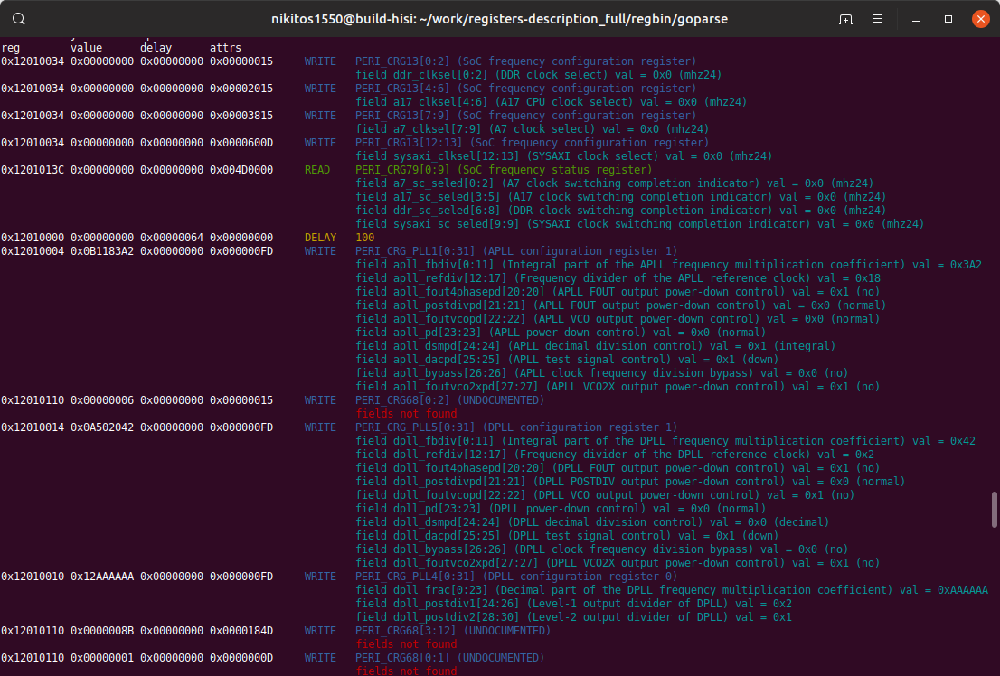
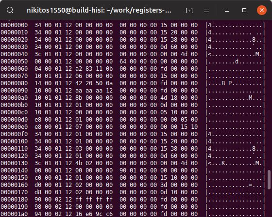

<!--

 

-->
<h3 align="center">hisi-initregtable-go-parser</h3>

---

HiSilicon SoC`s U-Boot initial register table parser into human readable format

<em>Part of <a href="https://www.openhisiipcam.org">OpenHisiIpCam</a> project</em>

## About

This app make this

From

## Build

## Usage
